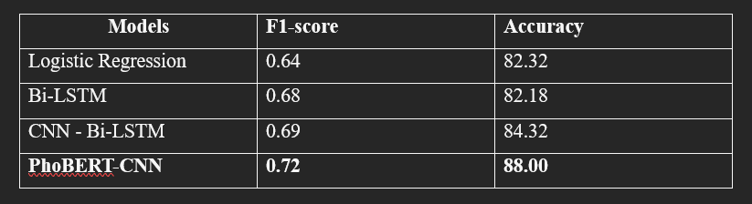

# Vietnamese Hate Speech Detection on Youtube using PhoBERT-CNN; CNN-BiLSTM; BiLSTM and Logistic Regression
THis repository aim to create a website that can dectect and let users have chances to deal with different type of comments on youtube:
- Clean
- Offensive
- Hate

This is a repository re-implementing the code of the paper ```Vietnamese-Hate-and-Offensive-Detection-using-PhoBERT-CNN-and-Social-Media-Streaming-Data```  for Data Mining final project

# pretrain model

### Phobert
Since the file is over 500mb so i can not put in gihub, you need to go to this google colab to download:
[phobert_cnn_model_part1_task2a_2.pt](https://drive.google.com/file/d/14W-JeIy6ZpO6UytWAa1p9LKWuudPHd_f/view?fbclid=IwAR1QXChK2rYCK1u9KTipD3QyeecsdFh4RdOZuVqKA-81P5XtW4XMumE3gdM)

[phobert_cnn_model_part2_task2a_2.pt](https://drive.google.com/file/d/13IV3v-YjXgrtNWx-EzNUDEVmwBnb9uK3/view?fbclid=IwAR3qaFzsCgIKicv8NQyQiEHIwHY-ivMxIfm0C0Op-ru2MeAF0l8Ki_RKNrA)

### BiLSTM and CNN-BiLSTM
in folder final/HateSpeechDetectionApp/Models/result
- **CNN_BiLSTM_model_reddit.h5** and **tokenizer_reddit.pickle** for CNN-BiLSTM
- **BiLSTM.h5** and **tokenizer_1.pickle** for BiLSTM

# Reference
- ```PhoBERT```: Pre-trained language models for Vietnamese - https://github.com/VinAIResearch/PhoBERT
- ```BiLSTM```: BiLSTM for text classification - https://www.kaggle.com/code/lapidshay/bilstm-for-text-classification
- ```CNN - BiLSTM```: Research on Text Classification Based on CNN and LSTM - https://ieeexplore.ieee.org/abstract/document/8873454
- ```Convolutional Neural Networks``` for Sentence Classification - https://github.com/yoonkim/CNN_sentence
- ```Apache spark```: a unified engine for big data processing - https://spark.apache.org/docs/3.1.1
- ```Apache kafka```: a distributed event-store and streaming platform: - https://kafka.apache.org/

<!-- # Project architecture


# Model architecture
 -->

# Installation
### for model
- Install necessary packages from requirements.txt file
```bash
    pip install -r HateSpeechDetectionApp/requirements.txt
```

- Set up kafka cluster locally: please refer to this document https://kafka.apache.org/quickstart#quickstart_startserver

- Create topic for data storage (run this code in the kafka path you have just set up): 
```bash
    bin/kafka-topics.sh --create --topic rawData  --bootstrap-server localhost:9092

    bin/kafka-topics.sh --create --topic anomalies  --bootstrap-server localhost:9092
```
### for website
###### Part 1: Prepare the Environment

1.1. Install Visual Studio Code:

- Visit the official Visual Studio Code page: https://code.visualstudio.com/
- Download and install Visual Studio Code with your computer's compatible operating system.

1.2. Install Node.js and npm:

- Visit the official Node.js page: https://nodejs.org
- Download and install Node.js and npm.
- Check if Node.js is installed with the command
```bash
    node –v
```
1.3. Install Kafka:
- Visit the Apache Kafka homepage (https://kafka.apache.org/downloads) to download the version of Kafka you want to install. Choose the version suitable for your operating system.

1.4. Install MongoDB:
- Download MongoDB: Visit the MongoDB homepage: mongodb.com/try/download/community. Choose the version suitable for your operating system and download it.
- Install MongoDB: Run the installation file (.msi) you just downloaded. Select "Complete" when asked about the installation type. Select "Run service as Network Service user" to run MongoDB as a Windows service.
- Environment setup: Create folder C:\data\db to store MongoDB data.

###### Part 2: Install libraries for reactjs:

2.1. Create a website using npm
- Go to the folder you want to put the website in
- Open terminal and type: 
```bash
    npx create-react-app ${Name of the website you want}
```

2.2. Unzip the source code files
- Move the 2 files src and server file into the web folder you just created (overwrite the original file)
- Move the **final** file to a separate folder (It's best to keep it in drive D so you don't need to change the path inside the file)

2.3. Install libraries for ReactJS:
- Go to the server directory and open terminal and type:

```bash
pip install Flask pymongo requests google-api-python-client beautifulsoup4
npm install express cors
```

- Go to the main directory of the website, open terminal and type:

```bash
npm install react recharts axios react-icons qrcode.react react-spinners
```

2.4. Set up database and collection for data storage:

- Change the names of databases and collections contained in the server, visomences and src files to match your created and set up database and collection names.

###### Part 3: Install API for YouTube (For your YouTube account)

- Go to [Google Cloud Console](https://console.cloud.google.com/), go to APIs and services and create a new project
- Go to the OAuth consent screen and create a new External server
- Go to the Identifiants section in Create IDs to create an API key and an OAuth client ID
- Go to Library to find Youtube Data API v3 and start it
- Finally, go into the Flask.py file (in the server) and the producer.py file (in **final** folder) change the value of Developer_Key with the new API key and change the path of Client_secret_life (in reject_comment.py) with the path of the file OAuth client ID

###### Part 4: Start the Web

4.1. Start the Zookeeper server
```bash
.\bin\windows\zookeeper-server-start.bat .\config\zookeeper.properties

.\bin\windows\kafka-server-start.bat .\config\server.properties

kafka-topics.bat --create --bootstrap-server localhost:9092 --replication-factor 1--partition 1 --topic “topic_name”
```

4.2. Start Consumer

Run file consumer.py

4.3. Launch Web

• Open a terminal in the server folder and type: node server.js
• Open a terminal in the server folder and type: python FlaskP.py
• Open a terminal in the main web folder and type: 
```bash
npm start
```


# Model Evaluation


<!-- # Evaluation on test dataset
| Metric | Precision | Recall | F1-score | Support |
|---|---|---|---|---|
| 0 | 0.9284 | 0.9261 | 0.9273 | 5562 |
| 1 | 0.4189 | 0.3932 | 0.4057 | 473 |
| 2 | 0.5218 | 0.5566 | 0.5386 | 645 |
| Accuracy | | | 0.8527 | 6680 |
| Macro Avg | 0.6231 | 0.6253 | 0.6239 | 6680 |
| Weighted Avg | 0.8531 | 0.8527 | 0.8528 | 6680 |

# Compare with other studies

- Outperfrom other approachs related to VietNamese Hate Speech Detection -->
